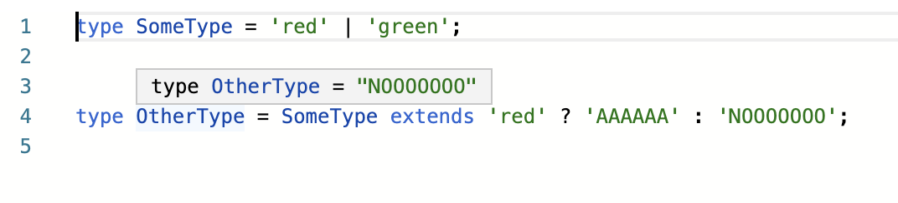
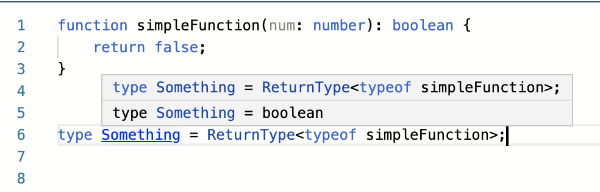
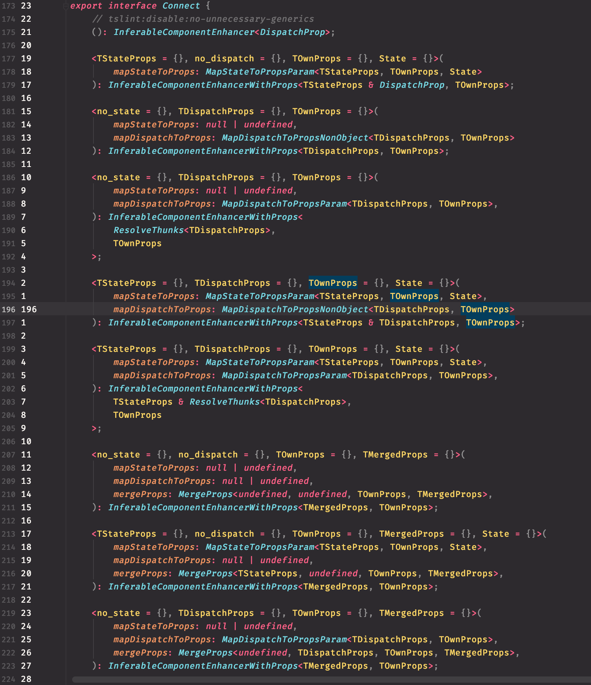
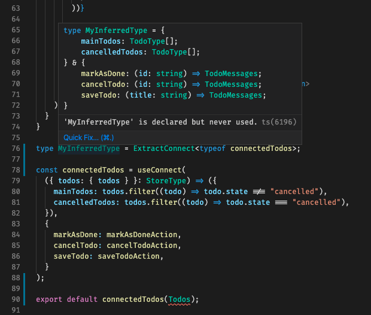

# Strong typed wrapper for Redux using Typescript

- TODO: Find a normal name

## Introduction

### TL;DR

The article explains the whole process of adding a typed wrapper around the default
redux methods. If you don't really need the whole ceremony of the article you can
skip directly to the source code
[github.com/nicu-chiciuc/redux-with-connect](https://github.com/nicu-chiciuc/redux-with-connect).

Below is an example of the pattern is use:

```typescript
// TODO: Add example here
```

## Intro to Redux

It is implied that you already know how redux works, if you don't,
this part should be like a very bad primer.
The main premise of Redux is that you have a global object
(not in the OOP sense, more like a record with data) usually called a Store
and you act as though it is immutable.
You can read values from it in you components and if you want to change it,
you pass a message (basically a JSON object) that contains a type field and some other data.
Based on that message you have some functions, called Reducers, that changes the Store.

There is much more to it and I recommend checking out [the official documentation](https://redux.js.org/).

### The sample project

The article is bassed on an internal article publishing inside the company I currently work for.
To make the code more palatable, I've created a
[very small project which uses Redux](https://github.com/nicu-chiciuc/redux-with-connect).
The logic of the project might seem a little ridiculous since it was not the aim of project.

# Simple types

Before going further imagine that in a different file you already defined the type of the Store and the types of the messages that can be passed to the store.

```typescript jsx
/// ./src/redux/index.ts
/**
 * The main type of the store
 */
export type StoreType = {
  todos: TodosStore
  checkboxes: CheckboxesStore
}

/**
 * A union type of all the possible messages
 */
export type MessageTypes = TodoMessages | CheckoxesMessages

const rootReducer = combineReducers<StoreType>({
  todos: todosReducer,
  checkboxes: checkboxReducer,
})

export const store = createStore(rootReducer)
```

Where `TodoMessages` and `CheckboxMessages` are [union types](https://www.typescriptlang.org/docs/handbook/advanced-types.html#union-types)

```typescript
/// ./src/redux/ReduxTodos.ts
export type TodoMessages =
  | {
      type: "TODOS/ADD_TODO"
      title: string
    }
  | {
      type: "TODOS/MARK_AS_DONE"
      id: string
    }
  | {
      type: "TODOS/CANCEL_TODO"
      id: string
    }
```

Most Redux tutorial would recommend defining action types as constant first.
That seems like a fear one would have in a world without static typing.

It looks kinda cryptic, but the basic idea is that a message can have a `type` from some set of types. And, for example if the `type` is `"TODOS/ADD_TODO"` the object should also contain a `title` property of type `string`. But this is more about business stuff, we're not concerned with that.

Let's get into the types.

Of course, the `connect` function from `react-redux` is _kinda_ typed, so you can tell it that you expect some stuff from it:

```typescript
const connectedTodos = connect(
  ({ todos: { todos } }: StoreType) => ({
    mainTodos: todos.filter(todo => todo.state !== "cancelled"),
    cancelledTodos: todos.filter(todo => todo.state === "cancelled"),
  }),
  {
    markAsDone: markAsDoneAction,
    cancelTodo: cancelTodoAction,
    saveTodo: saveTodoAction,
  }
)

export default connectedTodos(Todos)
```

As you can see we tell it that `store` has the type `StoreType` and now if we happen to change something in the StoreType, Typescript will scream until we fix everything we need to fix.

I guess this approach could work, but it seems too cumbersome, what if you forget to give `store` it's correct type. The `connect` function should know by default that `store` can only have one type. Unfortunately, the `react-redux` developers didn't know how our store will look and opening a PR each time we change something could be kinda annoying.

So here was the idea, what if, we create another function which will act exactly the same as `connect` but would always know that `store` has to have the type `StoreType` and that all the function in the second argument have to return an `MessageType`.

Below is the first commit to `bothConnect.ts`:

```typescript
import { ComponentType } from "react"
import { connect } from "react-redux"
import { StoreType } from "."

export type UseConnected<KnownProps> = <TProps>(
  Component: ComponentType<TProps & KnownProps>
) => ComponentType<TProps>

export type ExtractConnect<Something> = Something extends UseConnected<infer R>
  ? R
  : never

/**
 * This function works in the same way as the connect() from react-redux
 * but is more strict, knows the type of the store, and also allows to extract it's types very
 * easily using ExtractConnect
 */
export const useConnect = <PropsFromStore, PropsDispatch, TProps>(
  mapStateToProps: (store: StoreType) => PropsFromStore,
  mapDispatchToProps: PropsDispatch
): UseConnected<PropsFromStore & PropsDispatch> => <TProps>(
  Component: ComponentType<TProps & PropsFromStore & PropsDispatch>
): ComponentType<TProps> => {
  return connect(mapStateToProps, mapDispatchToProps)(Component as any)
}
```

There is some shady stuff going on, so let's unpack it.

First of all we'll have to dig into conditional types.

## Conditional Types

> [A conditional type selects one of two possible types based on a condition expressed as a type relationship test:](https://www.typescriptlang.org/docs/handbook/advanced-types.html#conditional-types)

```typescript
T extends U ? X : Y
```

I recommend trying [the Typescript Playground](https://www.typescriptlang.org/play/) to check how things work.

Conditional types are usually useful when you create typings for things that were initially written in JS and have a more complex interface. Or, when you want to write undecipherable code and then write blog posts about it.


Basically we created the type `OtherType` conditionally based on whether we could assign `SomeType` to `red`. You might ask yourself, what does `extends` exactly mean in this context. In short, nobody really knows and you usually need to poke it until it makes sense. The way I finally started to think about it is that when writing `A extends B ?...` you're asking yourself (or the compiler) if you have some object of type `A` can you pass it to a function that accepts a type `B`? In practice though, you usually have to test things out and use the playground until things kinda work.

## [Inferring types](https://www.typescriptlang.org/docs/handbook/advanced-types.html#type-inference-in-conditional-types)

Imagine that you are a simple function:

```typescript
function simpleFunction(): boolean {
  return false
}
```

And somewhere else you have some variable (variable `something`), and you want to say that variable `something` should have the same type as the return type of the function `simpleFunction`.

Of course, in this case you can just say that:

```typescript
const frick: boolean = true
```

But imagine that the function returned some other type and you don't really want to import another type and memorize it and whatnot. You just want to say that the variable `something` should always have the type as the return type of the `simpleFunction`.

```typescript
const something: ReturnType<typeof simpleFunction> = true
```

Somehow, `ReturnType` can extract a type from a different type

```typescript
type ReturnType<T> = T extends () => infer R ? R : never
```

This is (almost) the complete definition of `ReturnType`. Generally when thinking about generics in TS, think about them like functions that act on types instead of trying to fit in the OOP model (that usually helps with sleep too).

This means that, if you give me some type `T` and we somehow see that type `T` is some kind of function that return a `infer R`, then I return `R` otherwise return `never`. The actual definition of `ReturnType` in the document


`infer` only works with conditional types and the only (I think) use-case that I know of is to extract stuff from other types. These things only start to make sense after you try to use them and fail to do so for several months.

## `React.ComponentType<T>`

Another important thing is how to say that something is a react component.

Let's imagine that you wrote a component that besides the props that it expects from its parent, is also wrapped in a higher order component that passes it the prop `loading`. You can express that like so:

```typescript
function withLoading<TProps>(
  SomeComponent: React.ComponentType<TProps & { loading: boolean }>
): React.ComponentType<TProps> {
  return function WrappedComponent(mainProps: TProps) {
    return <SomeComponent {...mainProps} loading={false} />
  }
}

export default withLoading(ModalContainer)
```

There are other ways to do it, but this approach usually works the best.

> A lot of APIs use `Omit<T,K>`, `Exclud<T, U>` etc. But those approaches seem to cause more confusion down the road.

Basically the function `withLoading` can be passed some other component that has whatever props of type `TProps` and also MUST have a prop `loading` of type `boolean` and will return another component that shouldn't be passed the prop `loading` since we send it internally.

It looks kinda cryptic but that's life.

# `withConnect`

Below is the first iteration of `withConnect`

```typescript
import { ComponentType } from "react"
import { connect } from "react-redux"
import { StoreType } from "."

export type UseConnected<KnownProps> = <TProps>(
  Component: ComponentType<TProps & KnownProps>
) => ComponentType<TProps>

export type ExtractConnect<Something> = Something extends UseConnected<infer R>
  ? R
  : never

/**
 * This function works in the same way as the connect() from react-redux
 * but is more strict, knows the type of the store, and also allows to extract it's types very
 * easily using ExtractConnect
 */
export const useConnect: <PropsFromStore, PropsDispatch, TProps>(
  mapStateToProps: (store: StoreType) => PropsFromStore,
  mapDispatchToProps: PropsDispatch
) => UseConnected<PropsFromStore & PropsDispatch> = connect
```

Given some Component that has props of type `TProps` together with `PropsFromStore` and `PropsDispatch` it will return a component that has to be passed just `TProps`.

In this case, instead of `{loading: boolean}` we have some types that are also generic.

Since `connect` is a function that returns a function, things look ugly.

`mapStateToProps` is the function that is passed our `StoreType` and returns something from it. That something is not just `any`, it's a generic type that we're saving for later usage.

Same thing with `mapDispatchToProps`: it's an object and we save it's type.

This HOC (Higher-order component) could just replace the usage of `connect` since it doesn't interfere with its definition in any way.

`connect` is a function that gets a `mapStateToProps` and a `mapDispatchtoProps` and returns another function that should get a react component which should have some props that should include the `PropsFromStore` and `PropsDispatch` and it will return a component that has to be passed just the `TProps` without the props from redux.

This is a handful, but the definition is much much terse than the one in the official package:


It goes on and on. If we decide to not use `defaultProps`, we can get away with defining very specific types that are complex, but not extremely complex.

So why the need to define a `UseConnected<T>`?

The idea was that instead of defining the types that should be given from the `connect` function, I would like to have a inferred type so that I wouldn't need to give the types explicitly. Check this out:


Now we can define the `Props` without actually writing any types:

```typescript
type Props = { mainTitle: string } & ExtractConnect<typeof connectedTodos>
```

Basically what I wanted to do is just defined the very aptly-named `connectedTodos` and then let TS figure out the types and set them using `ExtractConnect<typeof connectedTodos>`.

If we don't use `UseConnected` TS tells us the whole type and it's kinda hard to figure out what's going on:

Also it's more clear to implement the ExtractConnected thingy:

```typescript
export type ExtractConnect<Something> = Something extends UseConnected<infer R>
  ? R
  : never
```

If we decide to change what exactly is `UseConnected` in the future, maybe it will be a more complex type of function, this thing will still work.

All in all, the goal was to trick TS into doing stuff for us, instead of us defining types all the time.

## Function overloading
